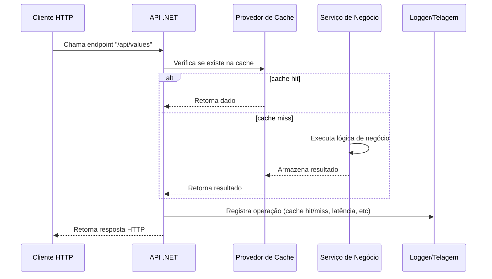

# 📘 CSharpCachingLogging

> Projeto de exemplo para implementação de **caching** e **logging** em aplicações .NET — demonstrando boas práticas de cache, monitoração e registro de log para sistemas backend.


---

## 📖 Visão Geral

Este projeto tem como objetivo:

- Mostrar como aplicar **caching** eficaz (em‑memória, distribuído ou híbrido) em serviços backend .NET.
- Demonstrar configuração e uso de **logging estruturado**, integração com provedores (por exemplo: Serilog, Microsoft Logging, Application Insights) e monitoramento de eventos.
- Prover um template organizado para equipes que desejam implementar esses componentes essenciais de forma consistente.

Ideal para desenvolvedores que querem:

- Entender como aplicar caching para melhorar desempenho e reduzir latência de operações.
- Configurar logging adequado para observabilidade, rastreabilidade e troubleshooting.
- Ter uma base de referência pronta para projetos corporativos .NET com caching + logging bem estruturados.

---

## 🧩 Estrutura do Projeto

```mermaid
graph TD
    A[CSharpCachingLogging]
    B[API] 
    C[Services]
    D[Infrastructure]
    E[Logging]
    F[Caching]
    G[Program.cs / Startup.cs]

    A --> B
    A --> C
    A --> D
    D --> E
    D --> F
    B --> G
````

**Descrição das pastas:**

* `API` → Projeto que expõe endpoints HTTP (.NET Web API ou Minimal API)
* `Services` → Lógica de negócio, operações que utilizam cache ou registram logs
* `Infrastructure` → Componentes de infraestrutura técnica (cache providers, loggers, middlewares)
* `Logging` → Configuração de logging, sinks, formatos estruturados, filtros
* `Caching` → Implementações de cache (ex: in‑memory, Redis, hybrid), políticas de expiração e invalidação
* `Program.cs / Startup.cs` → Inicialização da aplicação, registro de serviços de cache e logging

---

## 🧪 Tecnologias Utilizadas

* **.NET 8** — Plataforma moderna para backend
* **C#** — Linguagem principal
* **Microsoft.Extensions.Caching** / **StackExchange.Redis** (ou outro provider) — Caching
* **Serilog** / **Microsoft.Extensions.Logging** — Logging estruturado
* **Mermaid** — Para diagramas no README

---

## ⚙️ Pré‑requisitos

Antes de executar o projeto localmente, garanta:

* ✅ [.NET 8 SDK](https://dotnet.microsoft.com/download/dotnet/8.0)
* ✅ (Se aplicável) Instância de Redis ou outro cache distribuído
* ✅ Ambiente de logging configurado (ex: console, arquivo, Application Insights)

---

## 🚀 Como Executar Localmente

1. Clone o repositório:

```bash
git clone https://github.com/thiagodsantana/CSharpCachingLogging.git
cd CSharpCachingLogging
```

2. Restaure dependências:

```bash
dotnet restore
```

3. Configure suas credenciais ou strings de conexão no `appsettings.json` (ex: Redis, Application Insights)

4. Execute o projeto da API:

```bash
dotnet run --project API
```

5. Acesse o endpoint para testar caching ou logging, por exemplo:

```
GET /api/values   (Primeira chamada: cache miss, subsequent calls: cache hit)
```

6. Observe no console ou arquivo o log estruturado e verifique que dados estão sendo armazenados no cache conforme configurado.

---

## 📊 Diagrama de Fluxo – Cache e Logging



---

## 📋 Exemplos de Uso

### Exemplo de método com cache

```csharp
public async Task<MyDTO> GetValueAsync(string id)
{
    var cacheKey = $"MyValue:{id}";
    if (_cache.TryGetValue<MyDTO>(cacheKey, out var cached))
    {
        _logger.LogInformation("Cache hit for {CacheKey}", cacheKey);
        return cached;
    }

    _logger.LogInformation("Cache miss for {CacheKey}", cacheKey);
    var result = await _myService.FetchValueAsync(id);
    _cache.Set(cacheKey, result, TimeSpan.FromMinutes(10));
    return result;
}
```

### Exemplo de logging estruturado

```csharp
_logger.LogInformation("Processed request {RequestId} in {ElapsedMilliseconds}ms",
    context.TraceIdentifier,
    stopwatch.ElapsedMilliseconds);
```

---

## 📚 Boas Práticas Adotadas

* Use chaves de cache consistentes e previsíveis
* Defina políticas de expiração e invalidação claras para evitar stale data
* Monitore métricas de cache: hit rate, miss rate, latência
* Use logging estruturado (não apenas strings) para facilitar análise e correlação
* Separe responsabilidades: camada de cache, camada de negócio, camada de logging
* Tenha falha graciosa no cache: a aplicação deve funcionar sem cache, apenas com possível degradação de performance

---

## 🤝 Contribuindo

1. Faça um fork deste repositório
2. Crie uma branch para sua funcionalidade:

```bash
git checkout -b feature/nova‑implementacao-de-cache
```

3. Adicione melhorias ou novos providers de cache, novos sinks de log ou dashboards
4. Faça commit das alterações:

```bash
git commit -m "Adiciona suporte a RedisCache como provider"
```

5. Envie para seu fork:

```bash
git push origin feature/nova‑implementacao-de-cache
```

6. Abra um Pull Request para revisão.

---

## 🪪 Licença

Este projeto está sob a **Licença MIT** — livre para uso, estudo e modificação.

---

## ✉️ Contato

**Autor:** Thiago D. Santana
**LinkedIn:** [linkedin.com/in/thiagodsantana](https://linkedin.com/in/thiagodsantana)
**E‑mail:** [thiago.darley@gmail.com](mailto:thiago.darley@gmail.com)
